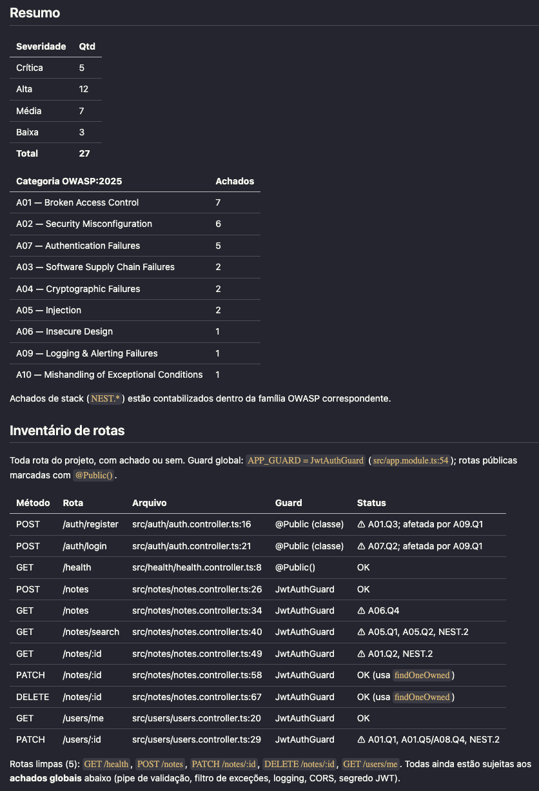

# claude-owasp-10

OWASP Top 10:2025 for Claude Code: security rules Claude applies **while it
writes your backend code**, plus `/api-secure-report`, a command that audits
every HTTP route in a project.

## What you get

**1. The `secure-coding` skill.** Claude reads it whenever it writes or changes
a route, guard, query, auth flow, app config or dependency — and flags the
unscoped lookup while writing the handler, when the fix costs nothing, even if
you never mentioned security:

```
you    add a GET /orders/:id endpoint

claude … writes the handler, then:

       A01.Q2 — orders.controller.ts:31 — the lookup is by id alone. An
       authenticated user can read any order by guessing the id. The guard
       proved who the caller is, not what they may reach.

       Scoped it in the query predicate instead of checking after the fetch:
         where: { id, tenantId: caller.tenantId }
```

**2. The `/api-secure-report` command.** It lists **every** route in the
project, marks each one clean or with findings, and reports each finding as
*route → vulnerability → how an attacker exploits it → fix*, citing the rule id:

<p align="center">
  
</p>
<p align="center"><sub>
  Summary and route inventory from a real run (pt-BR, the default language).
  Full report in English: <a href="examples/SECURITY-REPORT.example.md">examples/SECURITY-REPORT.example.md</a>,
  run against <a href="examples/vulnerable-app/">examples/vulnerable-app/</a>.
</sub></p>

## Install

Pick one — both give you the same files.

### Option 1 — for you, in every project

```
/plugin marketplace add joaovicdev/claude-owasp-10
/plugin install secure-coding@claude-owasp-10
```

Then add the trigger to your global `CLAUDE.md` (or paste
[`TRIGGER.md`](skills/secure-coding/TRIGGER.md) in by hand):

```bash
curl -sL https://raw.githubusercontent.com/joaovicdev/claude-owasp-10/main/skills/secure-coding/TRIGGER.md \
  >> ~/.claude/CLAUDE.md
```

### Option 2 — for one repository, shared with your team

```bash
git clone https://github.com/joaovicdev/claude-owasp-10
./claude-owasp-10/install.sh --project /path/to/your/repo
```

This copies the skills into `.claude/skills/`, the read-only auditor into
`.claude/agents/`, imports the trigger in the repo's `CLAUDE.md`, and gitignores
`SECURITY-REPORT.md`. Commit the result — teammates get it on their next pull.

> **The trigger is not optional.** *"Add an endpoint"* does not read as a
> security request, so nothing would make Claude open the skill on its own.
> `TRIGGER.md` inlines the eight baseline rules and tells Claude when to load the
> rest. Without it the material sits on disk unused — and you cannot tell.

### Verify

`./install.sh --check /path/to/your/repo` (from a clone) reports what is
installed and whether the trigger is wired. Or ask Claude, inside the project:

1. *"What security rules apply to adding a route that takes an id?"* — must say
   the lookup is scoped by the caller **in the query**; generic "validate your
   input" advice means the trigger never fired.
2. *"Load the secure-coding skill — which manifest row covers CORS?"* — must
   answer `A02`; anything else means Claude cannot find the files.

They fail separately: 1 tests the trigger, 2 the skill.

## Usage

The skill needs no command — it applies itself, as shown above. The report is
a command, run inside a backend project:

```bash
/api-secure-report                            # pt-BR, whole repository
/api-secure-report en                         # another language; ids, paths and code stay as-is
/api-secure-report pt-BR src/modules/orders   # scoped to a subdirectory
```

It prints to the terminal and writes `SECURITY-REPORT.md` to the project root,
overwriting the previous one.

## Good to know

- **No network.** Plain Markdown, read locally — nothing uploaded, no telemetry.
- **Nothing is modified.** The report skill has no `Edit`; its `security-auditor`
  subagents have no `Write` or `Edit` either, enforced by the agent definition.
  The only file written is the report.
- **The report is sensitive.** It quotes internal paths and spells out how to
  exploit them. Keep it out of git (`install.sh --project` does; otherwise the
  skill offers to).
- **A clean report is not proof.** Every run ends with a `Limits` section
  saying what was not scanned — read it.
- **Stacks.** `nestjs.md` is grounded in production code; `laravel.md` and
  `spring-boot.md` come from the docs and say `Status: unverified`. Any other
  stack gets the language-agnostic core alone — by design, not a degraded mode.
- **Per-project findings.** Copy
  [`templates/SECURITY-NOTES.md`](skills/secure-coding/templates/SECURITY-NOTES.md)
  to a project root; the skill reads it, and the report lists what is there as
  accepted risks instead of new findings.

## Layout

```
.claude-plugin/       plugin.json, marketplace.json — this repo is its own marketplace
skills/
  secure-coding/      SKILL.md (loader + manifest), TRIGGER.md,
                      owasp/ (A01..A10, agnostic core), stacks/, templates/
  api-secure-report/  the reference consumer of secure-coding
agents/               security-auditor — read-only, dispatched by the report skill
examples/             vulnerable-app/, its SECURITY-REPORT.example.md, the screenshot above
install.sh            the non-plugin route: --project, --check
scripts/check-ids.sh  material integrity, run in CI
```

## Contributing

[`CONTRIBUTING.md`](CONTRIBUTING.md) has the recipe for adding a stack file
(`stacks/_TEMPLATE.md` is the blank) and the conventions the material follows.
`./scripts/check-ids.sh` enforces the ones that can be enforced mechanically.

## Attribution

The category names, numbering, ordering and scope in `owasp/` follow the
[**OWASP Top 10:2025**](https://owasp.org/Top10/2025/) and were checked against
the official pages, which are the authority — where this repo and OWASP
disagree, OWASP is right and the disagreement is a bug worth filing. The prose,
review questions, pseudocode and grep signals are original work written for this
repository; they are not an OWASP publication.

**This project is not affiliated with, endorsed by, or maintained by the OWASP
Foundation.** "OWASP" is their trademark and appears here only to identify the
material this skill is built from.

## License

MIT — see [`LICENSE`](LICENSE). MIT does not carry the attribution above into
forks; keeping it is a courtesy to the people who did the underlying work, not a
legal obligation.
